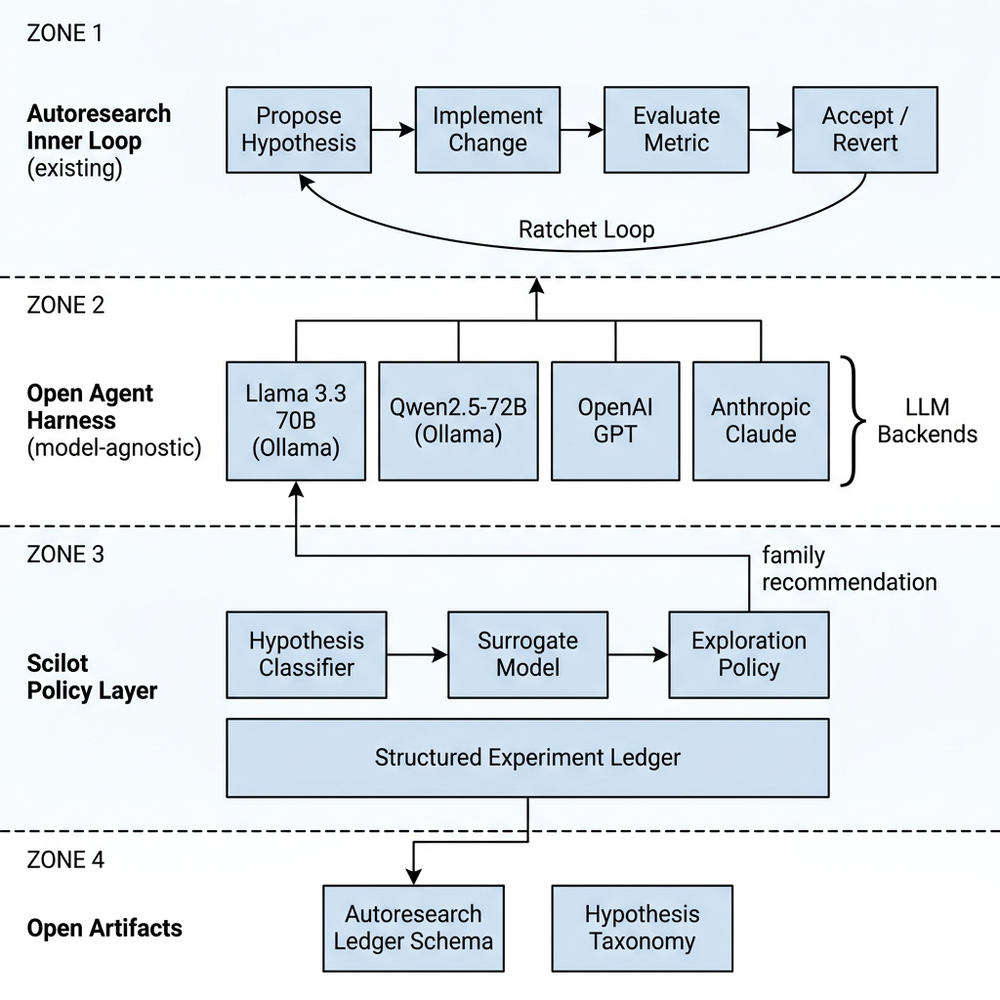

# Scilot

An exploration-exploitation layer for autonomous ML research loops.

## What is Scilot?

Scilot is a model-agnostic policy layer that sits on top of existing autoresearch loops (e.g., Karpathy's [autoresearch](https://github.com/karpathy/autoresearch)) and adds structured exploration. The architecture has four zones:

- **Zone 1 — Autoresearch Inner Loop (existing):** the standard ratchet loop — propose hypothesis → implement change → evaluate metric → accept/revert — via a git-based ratchet.
- **Zone 2 — Open Agent Harness:** model-agnostic harness supporting both local open-source models (Llama 3.3 70B, Qwen2.5-72B via Ollama) and commercial APIs (OpenAI GPT, Anthropic Claude).
- **Zone 3 — Scilot Policy Layer:** a Hypothesis Classifier and Surrogate Model feed an Exploration Policy that sends AI model family recommendations back into the loop. All experiments are recorded in a Structured Experiment Ledger.
- **Zone 4 — Open Artifacts:** the Autoresearch Ledger Schema and Hypothesis Taxonomy are published as open interoperability artifacts.

## Motivation

Existing autoresearch strategies treat all hypothesis families equally and produce no reusable experiment record. Scilot adds the exploration infrastructure that is missing: principled hypothesis selection, a surrogate model trained on past runs, and open schemas that make experiment records portable across tools and teams.

## Status

Under development. Funded by [NGI Zero Commons Fund](https://nlnet.nl/commonsfund/) (NLnet Foundation, 13th round).
